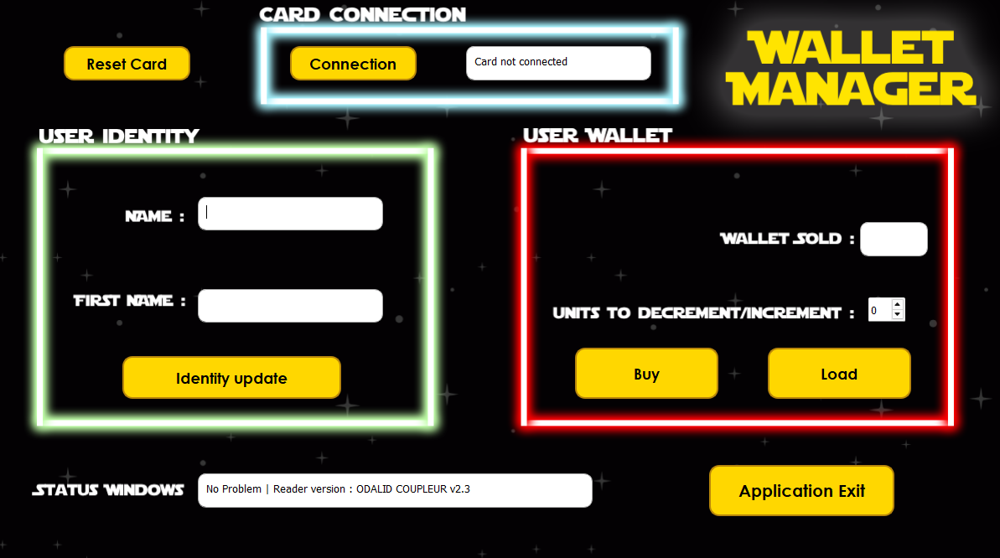

# NFC Wallet Reader App

A Qt-based desktop application to interact with NFC cards, allowing read, write, increment, and decrement operations on a wallet block. Built using C++ and Qt Widgets.

---

## Features

- Connect to an NFC card via a USB CDC reader
- Read and write Name and First Name into identity block
- Increment or decrement wallet block balance safely (backup)
- Real-time status and error display on UI

---

## HMI



---

## Requirements

- Qt 5.15.2
- MinGW 64 bit
- ODALIB libraries

---

## Build & Run

### Using Qt Creator:
1. Clone this repository:
   ```bash
   git clone https://github.com/yourusername/nfc-wallet-reader.git

2. Open nfc-wallet-reader.pro in Qt Creator

3. Click "Build" and "Run"
